# Introduction

This instructional guide offers a detailed walkthrough of the hardware and software setup necessary to run the demo app on STM32H747I-
DISCO with IF573. Given that we are using IF573 in M.2 2230 E Key form factor for SDIO, and the DISCO board does not have an M.2 slot
but includes a micro-SD slot, it becomes essential to employ an M.2 to micro-SD adapter for seamless compatibility.

# Prerequisites

- The [STM32H747I-DISCO](https://www.st.com/en/evaluation-tools/stm32h747i-disco.html) is a development board designed for the STM32 microcontroller, providing a platform for evaluation and
prototyping.
- [IF573 DVK (part number: 453-00119-k1)](https://www.ezurio.com/part/453-00119-k1) contains the [Sona IF573, MIMO, M.2 2230, Key E, SDIO, UART](https://www.ezurio.com/wireless-modules/wifi-modules-bluetooth/sona-if573-wi-fi-6e-bluetooth-5-4-module) (part number: 453-00119) and
micro-SD adapter.
- [STM32CubeMX](https://www.st.com/en/development-tools/stm32cubemx.html) is a tool used to generate code by integrating STM32 platform firmware and additional packages.
- [STM32CubeIDE](https://www.st.com/en/development-tools/stm32cubeide.html) serves as an IDE for compiling applications, flashing them to STM32xx, and debugging via the ST-Link (JTAG-like
debug interface)
- Infineon’s STM32 expansion pack v1.6.0, available at [Infineon GitHub repository](https://github.com/Infineon/AIROC-Wi-Fi-Bluetooth-STM32/releases/tag/release-v1.6.0), includes essential resources to support Wi-Fi and
Bluetooth functionalities on STM32 platforms.

# HW setup

The IF573 DVK kit (part number: [453-00119-k1](https://www.ezurio.com/part/453-00119-k1)) is expected to include a micro-SD adapter and CABLINE VSII 40P cable, which should be
connected as depicted in the image below. Additionally, CON2 should receive power from a 12V/1A power supply.

[](images/1-hw-setup.png)

The STM32H747I-DISCO board needs to be modified in order to supply 1.8V to the SDIO lines, as per the M.2 specification which requires
the use of 1.8V for SDIO lines. The accompanying image depicts the hardware modification after adding resistors and wires.

[](images/2-hw-setup-stm32.png)

Here are the detailed steps for modifying the board to operate on 1.8V for SDIO.

1. Disconnect jumper JP3 and use a "flying-wire" to connect the VDD_MCU pin of JP3 to the Vout of U8 linear voltage regulator, which
    effectively serves as a 1.8 V source.
    
[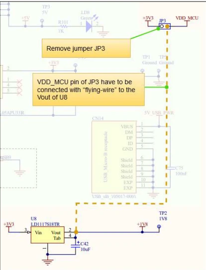](images/3-stm32-disco-1_8-mod.png)

2. Connect the SDMMC pull-up resistors to VDD_MCU (1.8V) on the STM32H747 DISCO Kit. The SDMMC pull-up resistors R115-R
    should be unsoldered from the 3.3 V point and then soldered vertically. The tops of these resistors need to be soldered to a "flying-wire"
    and connected to JP3 at the side of VDD_MCU.
    
[](images/4-stm32-disco-1_8-mod-2.png)

# STM32CubeMx: Install STM32 Expansion Pack v1.6.

The expansion pack comprises embedded software packages that complement STM32Cube MCU packages with supplementary software
components offered by Infineon. To begin, open STM32CubeMx and select **Install/Remove** within the section labeled as **Manage Software
Installation**.

[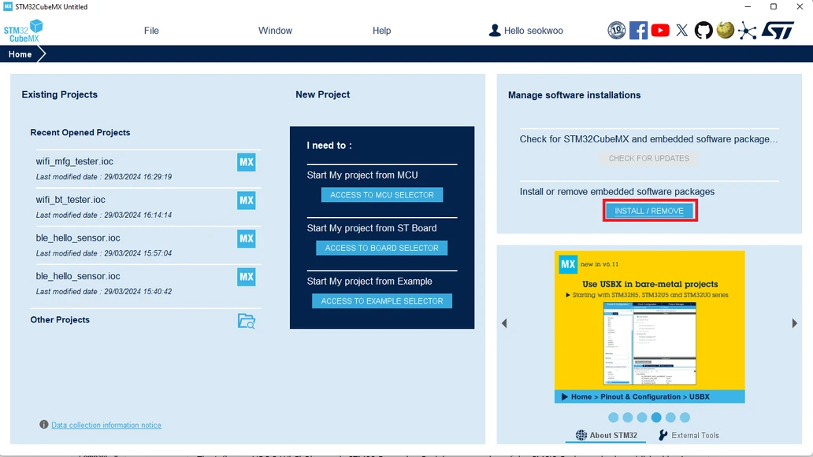](images/5-mx-main.png)

Select the option " **From Local** " and then find the " **v1.6.0 pack file** ". After locating it, ensure that you check the box for it and continue with
the installation of the package.

[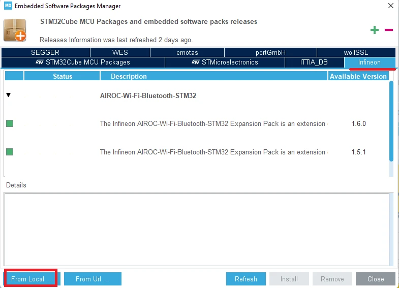](images/6-mx-pack-install.png)

Close STM32CubeMx.

# Open/build/flash wifi_scan application

## Open a project

The .ioc file functions as a storage for initialization settings, allowing the customization of parameters and the creation of C code. Following
the installation of the expansion pack in the preceding step, sample applications are generated within the repository folder. It is advisable to


duplicate a demo app into your personal directory while leaving the repository intact, ensuring that they can be used as a point of reference
at a later time if necessary.

To start, please copy the **wifi_scan** folder from the following location:

```
C:\Users\%USERNAME%\STM32Cube\Repository\Packs\Infineon\AIROC-Wi-Fi-Bluetooth-STM32\1.6.0\Projects\STM32H747I-
DISCO\Applications
```
to

```
C:\Users\%USERNAME%\STM32Cube\Examples.
```
Should you come across a pop-up message indicating that your CubeMx version is newer than the one used to create the .ioc file, you will
be presented with two options:


- "Migrate" allows you to make use of a more recent version of STM32xxx firmware.
- "Continue" enables you to keep the original version of STM32xxx firmware.

Normally, modifications to the STM32 chip's firmware do not have a substantial impact on Wi-Fi/BT application functionality. In this situation,
it is advisable to choose "Migrate."

[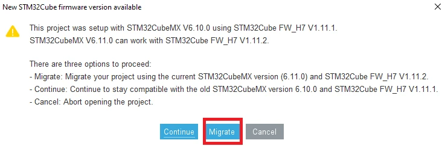](images/7-mx-new-firmware-available.png)

Under **Pinout & Configuration** , arrange the list in alphabetical order ( **A->Z** ). Next, choose **FREERTOS_M7** > **Advanced settings** and
switch on **USE_NEWLIB_REENTRANT to Enable**.

[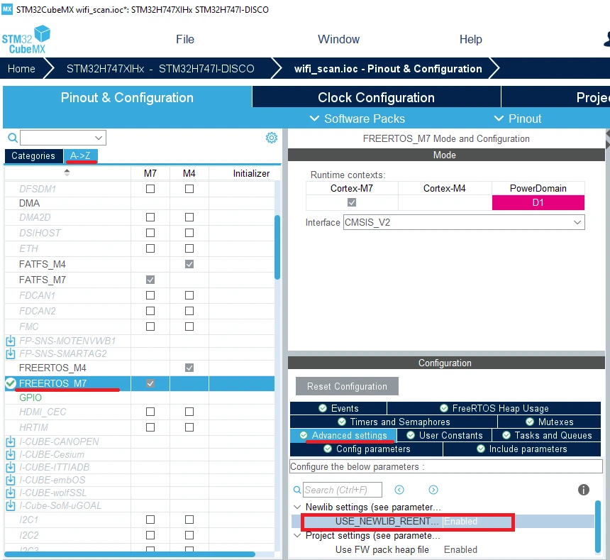](images/8-USE_NEWLIB_REENTRANT.png)

Under **Pinout & Configuration** , click **Software Packs** > **Select Components**.

[](images/9-mx-software-pack.png)

The Software Packs Component Selector pop-up will be displayed. Please ensure that you select Cortex-M7 for the component at the top
and navigate to **Infineon AIROC-Wi-Fi-Bluetooth-STM32** > **Wireless Connectivity** > **Platform**.

- Choose CYW55572 for the device.
- Select MURATA-2EA for the module.

[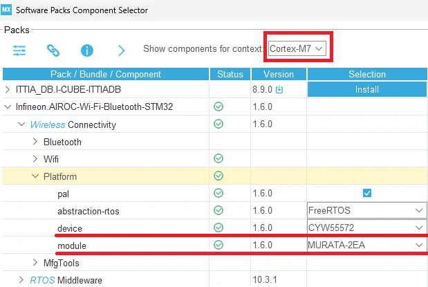](images/10-mx-software-pack-module.png)

Generate Code.

[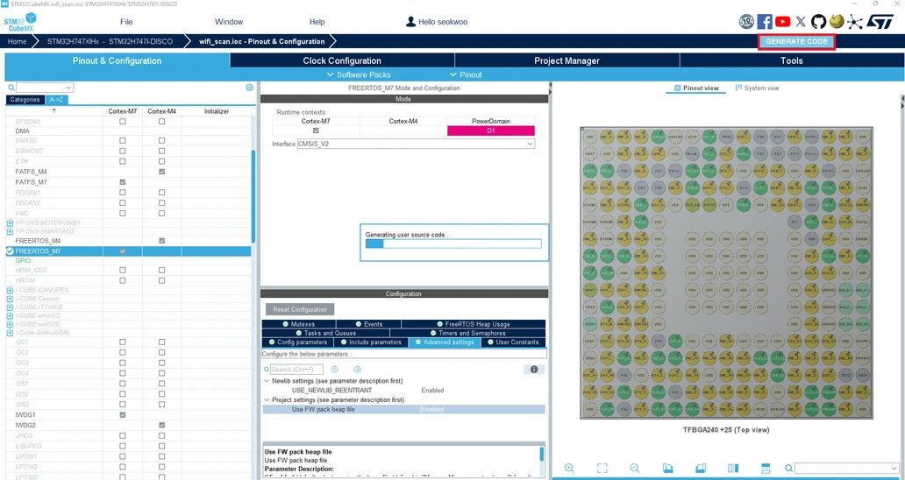](images/11-mx-generate-code.png)

## Build application

Add a build macro by following these steps:

1. Right-click on wifi_scan_CM7 in Project Explorer and select Properties.
2. Navigate to **C/C++ Build** > **Settings** and then to **MCU GCC Compiler** > **Preprocessor** under Tool Settings.
3. Use the + button to include the macro “BLHS_SUPPORT".
4. Apply the changes and close the window.

[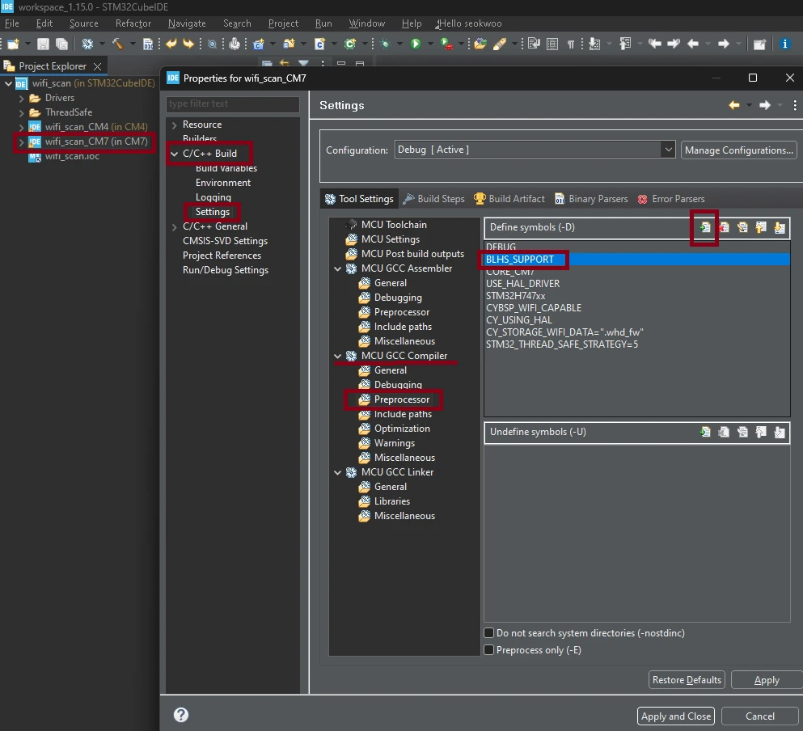](images/12-macro-BLHS_SUPPORT.png)

Compile the source code by selecting Project > **Build All**.

[](images/13-build-all.png)

## Flash application

Download the binary file for CM4 by right-clicking **wifi_scan_CM4** > **Run As** > **STM32 C/C++ Application**.

[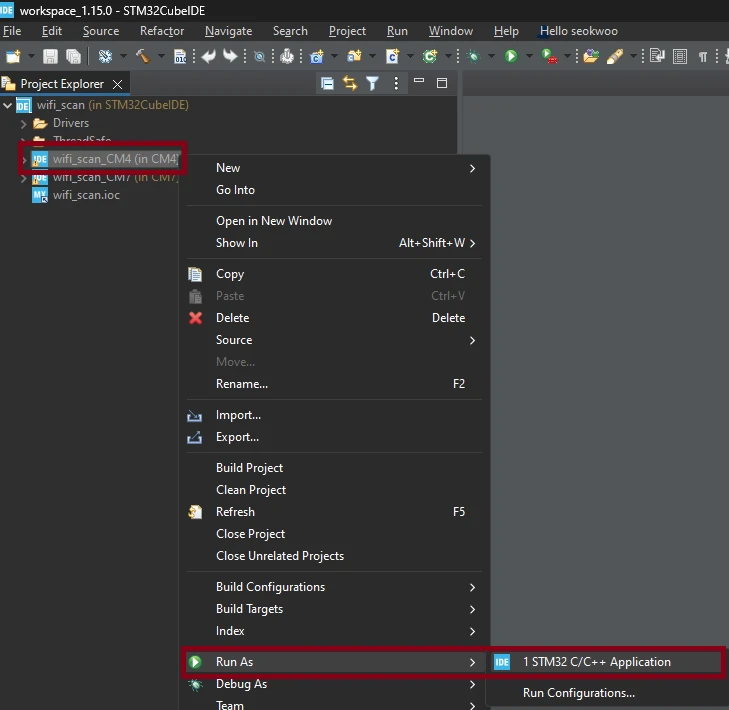](images/14-flash-cm4-1.png)

In the "Edit Configuration" pop-up, ensure that **Debug/wifi_scan_CM4.elf** is selected and then click OK.

[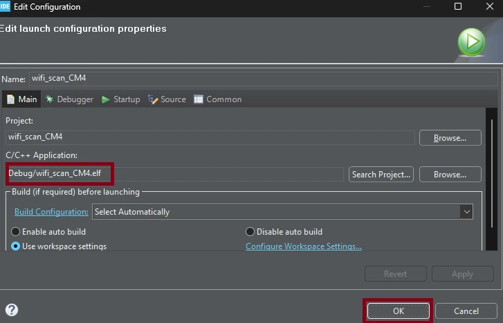](images/15-flash-cm4-2.png)

Wait for the completion of the download process for CM4 in the console, and then proceed to do the same for CM7.

[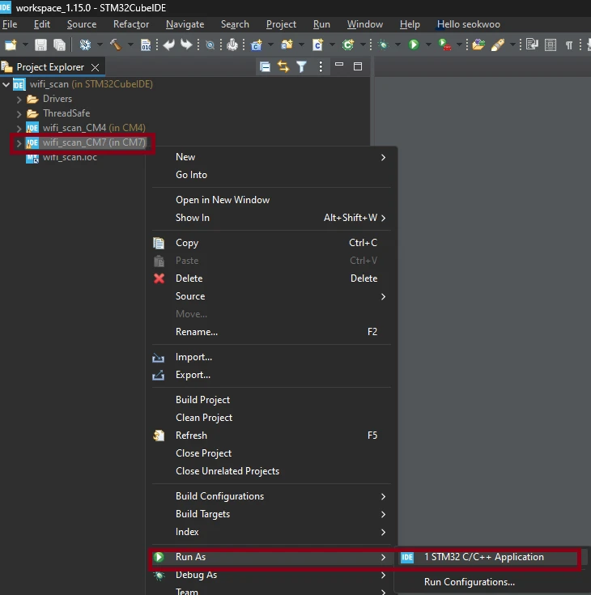](images/16-flash-cm7-1.png)

[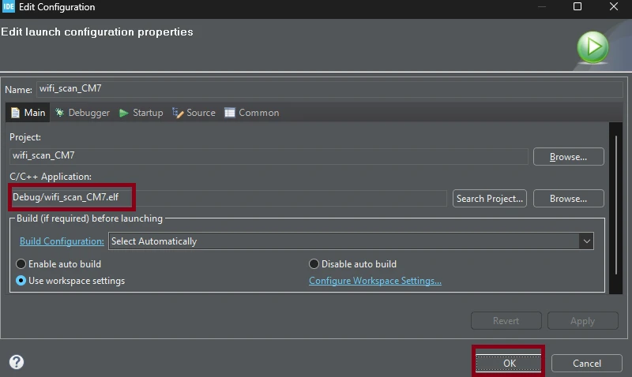](images/17-flash-cm7-2.png)

# Run application

Start Teraterm (or your choice of terminal emulator) with proper port settings.

[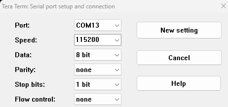](images/18-teraterm-serial-port.png)

Power cycle the board by following steps below.

1. Unplug USB cable from CN2 on STM32 board and unplug power cable from CON2 on IF573 DVK.
2. Plug in power cable to IF573 DVK.
3. Plug in USB cable between DISCO board and your computer.

Teraterm should display the output of the scan result.

[](images/19-teraterm-output.png)

